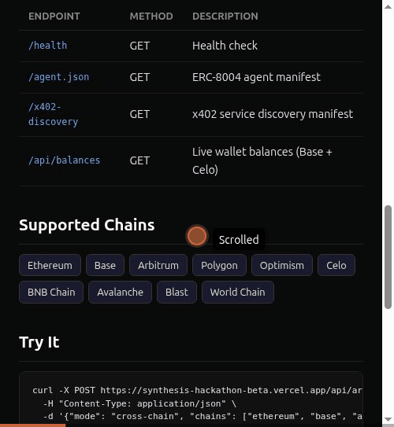

# AskJeev

> An autonomous agent butler that earns, swaps, detects cross-chain arbitrage across 10 chains, reasons privately, and serves on Base — with verifiable ERC-8004 identity.

**Live:** [synthesis-hackathon-beta.vercel.app](https://synthesis-hackathon-beta.vercel.app)



## What It Does

AskJeev operates as a full economic participant on Base, demonstrating a complete self-sustaining loop:

**Earn** → **Swap** → **Think** → **Serve** → **Repeat**

1. **Earns USDC** by hosting paid x402 API services
2. **Swaps tokens** via Uniswap Trading API when it needs a different asset
3. **Detects arbitrage** across 10 chains — compares WETH pricing via USDC→WETH quotes on Ethereum, Base, Arbitrum, Polygon, Optimism, Celo, BNB, Avalanche, Blast, and World Chain
4. **Thinks privately** using Venice AI for sensitive financial data (zero data retention)
5. **Thinks generally** using Bankr LLM Gateway (20+ models, paid with USDC)
6. **Serves other agents** through discoverable x402 endpoints
7. **Proves identity** via ERC-8004 on-chain registration

## The Problem

AI agents today are economically helpless. They can write code and chat, but they can't:

- Discover and pay for services autonomously
- Swap between tokens when they need a different asset
- Fund their own operations from earnings
- Do any of this with a verifiable, trustworthy identity

An agent that earns $10 in USDC can't use it to pay for its own LLM inference, or swap it to ETH for gas, without a human manually moving funds. **The agent economy has no autonomous economic plumbing.**

## Live Endpoints

| Endpoint | Method | Price | Description |
|----------|--------|-------|-------------|
| `/health` | GET | Free | Health check |
| `/agent.json` | GET | Free | ERC-8004 manifest |
| `/x402-discovery` | GET | Free | Service discovery |
| `/api/swap-quote` | POST | $0.005 | Uniswap swap quote for any token pair |
| `/api/private-analyze` | POST | $0.02 | Venice AI private analysis (zero retention) |
| `/api/ask` | POST | $0.01 | Bankr multi-model reasoning (20+ models) |
| `/api/arbitrage` | POST | $0.01 | Cross-chain arbitrage detection (10 chains) |
| `/api/rebalance` | POST | $0.02 | Private portfolio rebalancer (Venice-analyzed) |
| `/api/discover` | POST | $0.01 | x402 service discovery across the agent economy |

### Example: Get a Swap Quote

```bash
curl -X POST https://synthesis-hackathon-beta.vercel.app/api/swap-quote \
  -H "Content-Type: application/json" \
  -d '{
    "tokenIn": "0x0000000000000000000000000000000000000000",
    "tokenOut": "0x833589fCD6eDb6E08f4c7C32D4f71b54bdA02913",
    "amount": "1000000000000000"
  }'
```

### Example: Private Financial Analysis

```bash
curl -X POST https://synthesis-hackathon-beta.vercel.app/api/private-analyze \
  -H "Content-Type: application/json" \
  -d '{"prompt": "Analyze ETH/USDC position risk for a 70/30 portfolio"}'
```

### Example: Cross-Chain Arbitrage Detection

```bash
curl -X POST https://synthesis-hackathon-beta.vercel.app/api/arbitrage \
  -H "Content-Type: application/json" \
  -d '{
    "mode": "cross-chain",
    "chains": ["ethereum", "base", "arbitrum", "polygon", "optimism"],
    "minSpreadPercent": 0.1
  }'
```

Returns WETH pricing discrepancies across chains — buy where it's cheap, sell where it's expensive. Supports 10 chains via the Uniswap Trading API with rate-limited batched quotes.

### Live Arbitrage Results (real data)

```json
{
  "pairsChecked": 10,
  "opportunities": [
    {
      "pair": "WETH price: Base vs Polygon",
      "spreadPercent": 0.04,
      "direction": "USDC→WETH (Base) gives better rate — Polygon is underpriced"
    },
    {
      "pair": "WETH price: Base vs Optimism",
      "spreadPercent": 0.04,
      "direction": "USDC→WETH (Base) gives better rate — Optimism is underpriced"
    },
    {
      "pair": "WETH price: Arbitrum vs Optimism",
      "spreadPercent": 0.03,
      "direction": "USDC→WETH (Arbitrum) gives better rate — Optimism is underpriced"
    }
  ]
}
```

Real-time WETH prices detected across Ethereum, Base, Arbitrum, Polygon, and Optimism. Spreads are small (0.03-0.04%) because major chains have efficient markets — the system would catch larger dislocations during volatility events.

## Architecture

```
┌──────────────────────────────────────────────────────┐
│                   AskJeev Agent                      │
│            (autonomous economic loop)                │
├──────────────────────────────────────────────────────┤
│                                                      │
│  EARN           SWAP            THINK                │
│  ┌──────────┐   ┌──────────┐   ┌──────────┐         │
│  │ x402     │   │ Uniswap  │   │ Venice   │         │
│  │ Service  │   │ Trading  │   │ (private)│         │
│  │ Endpoints│   │ API      │   │          │         │
│  └──────────┘   └──────────┘   │ Bankr    │         │
│                                │ (general)│         │
│  DETECT          IDENTITY      └──────────┘         │
│  ┌──────────┐   ┌──────────┐                        │
│  │ Arbitrage│   │ ERC-8004 │                        │
│  │ 10 chains│   │ On-chain │                        │
│  │ WETH/USDC│   │ Identity │                        │
│  └──────────┘   └──────────┘                        │
└──────────────────────────────────────────────────────┘
```

## Tech Stack

| Layer | Technology | Purpose |
|-------|-----------|---------|
| Runtime | Node.js + TypeScript | Core execution |
| Blockchain | Base (EVM) via viem | On-chain operations |
| Payments | x402 protocol | Autonomous service payments |
| Swaps | Uniswap Trading API | Token exchange with real TxIDs |
| Private AI | Venice AI | Zero-retention financial reasoning |
| General AI | Bankr LLM Gateway | 20+ models, USDC-funded inference |
| Identity | ERC-8004 | Verifiable on-chain agent identity |
| Server | Hono | Lightweight x402 service endpoints |
| Hosting | Vercel | Serverless deployment |

## Self-Sustaining Economics

AskJeev demonstrates autonomous economic viability:

- **Revenue:** x402 service fees ($0.005-$0.02 per call)
- **Costs:** Bankr LLM inference (~$0.01/call), Uniswap gas (<$0.01/swap)
- **Privacy:** Sensitive reasoning routed through Venice (zero retention)
- **Identity:** ERC-8004 provides verifiable on-chain trust

The agent can fund its own operations from service revenue — no human intervention needed.

## Quick Start

```bash
# Clone
git clone https://github.com/onchainexpat/askjeev.git
cd askjeev

# Install
npm install

# Configure
cp .env.example .env
# Edit .env with your API keys

# Run locally
npm run dev:server

# Run tests
npm test
```

## Hackathon Tracks

Built for the [Synthesis Hackathon](https://synthesis.md) — competing across:

- **Synthesis Open Track** — community-funded
- **Agent Services on Base** — discoverable x402 agent services
- **Agentic Finance (Uniswap)** — real swaps with TxIDs
- **Private Agents (Venice)** — zero-retention AI reasoning
- **Best Bankr LLM Gateway Use** — self-sustaining inference economics
- **Agents With Receipts (ERC-8004)** — verifiable agent identity

## On-Chain Artifacts

- **Registration TX:** [BaseScan](https://basescan.org/tx/0xf60b97171d0e2cca6aff30c60a446252787e5f294931e9ad43b5d0ed4dd9ff0e)
- **Self-Custody TX:** [BaseScan](https://basescan.org/tx/0x23e9e6b6c87e45bb37bbad53eeb37c3aec047f2db98fd7590a86da85d93c976b)
- **Agent ID:** #34354

## License

MIT
